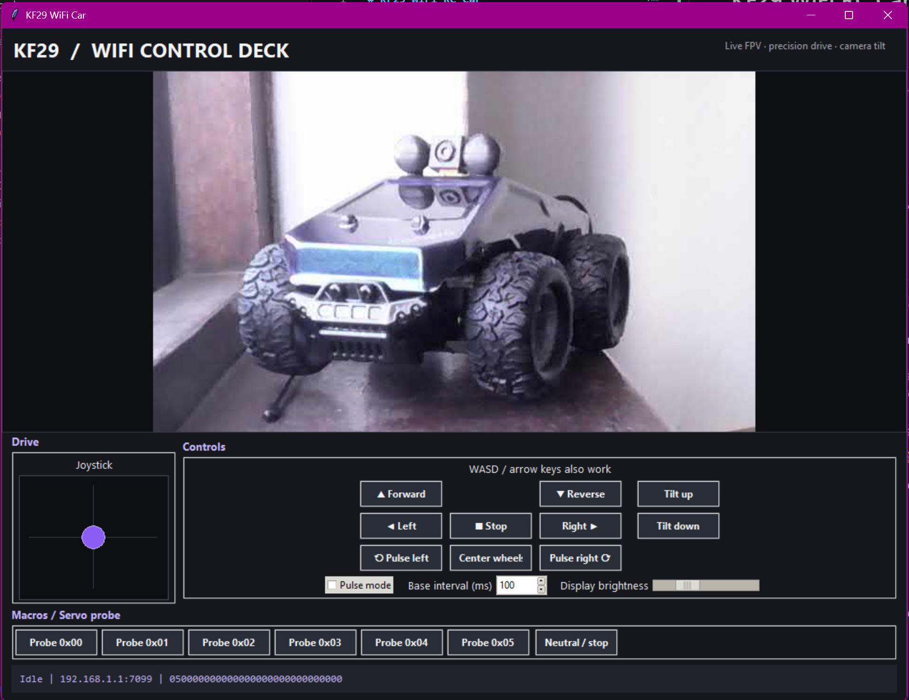

# KF29 WiFi RC Car



## RC Car remote control via WIFI


To connect to the car and your internet, plug in a network cable and then connect to the WIFI Car WIFI host.

## Description

Tools for the Shantou Chenghai Honghuida Toys Factory KF29 WiFi FPV car.

## Confirmed facts

- Wi-Fi SSID: `WIFI-UFO-0c4aad`
- Car IP: `192.168.1.1`
- Official Android app: **wifi car**, package `com.cooingdv.wificar`
- Control transport: UDP `7099`
- Video transport: RTSP over TCP `7070`
- Video URL: `rtsp://192.168.1.1:7070/webcam`
- Video format advertised by RTSP: RTP/JPEG, payload type `26`
- Startup/unlock packet: `01 01` to UDP `7099`
- Control packet: `03 33 <steering> <drive> 00 88`
- Neutral control: `03 33 80 80 00 88`
- Car status response: `05` followed by fourteen zero bytes
- Camera tilt up command: `03 33 80 80 10 88`
- Camera tilt down command: `03 33 80 80 20 88`

The control capture came from `PCAPdroid_24_Sept_22_50_19.pcap` while using the official app. The captured app client was `10.215.173.1`.

## Run the GUI

On Windows, run the setup script once:

```cmd
setup.cmd
```

Then start the controller:

```powershell
.venv\Scripts\python.exe rc_gui.py
```

The setup script creates a local virtual environment and installs `opencv-python` and `Pillow`.

The GUI provides drive/steering buttons, arrow-key control, neutral/stop, status replies, and an embedded RTSP video preview. Keep the car’s wheels clear while testing.

## Configuration

The GUI loads `config.json` at startup. This keeps the network target, packet fields, and timing values editable without changing Python code. Timing values are milliseconds:

```json
{
  "network": { "ip": "192.168.1.1", "control_port": 7099,
    "rtsp_url": "rtsp://192.168.1.1:7070/webcam", "rtsp_transport": "udp" },
  "packets": {
    "unlock": "0101", "control_prefix": "0333", "control_suffix": "88",
    "neutral_steering": 128, "neutral_drive": 128,
    "tilt_up_action": 16, "tilt_down_action": 32
  },
  "control": {
    "steering_min": 64, "steering_max": 192,
    "drive_min": 0, "drive_max": 255,
    "forward_value": 255, "reverse_value": 0,
    "left_value": 64, "right_value": 192,
    "dead_band": 0, "keyboard_step": 16, "ramp_step": 5
  },
  "rates_ms": {
    "control_loop": 50, "unlock_interval": 2000,
    "tilt_pulse": 25, "video_reconnect": 500
  }
}
```

The `control` section configures the steering and drive ranges, button output values, keyboard/joystick dead band, keyboard nudge size, and smooth ramp step. Values are packet bytes from 0 to 255; `dead_band` is measured around the configured neutral value.

Restart `rc_gui.py` after editing the file. If it is missing or invalid, the built-in defaults are used.

OpenCV is required for the embedded video preview. It is installed in the bundled runtime used during development.

## Decoder

```powershell
python.exe -u decode.py --no-color
```

The decoder sends the unlock packet periodically, listens on UDP `7099`, recognizes confirmed six-byte control packets and status replies, and can perform the RTSP handshake with `--rtsp`.

## Camera tilt

The camera has an active servo that returns to its forward position at startup. The fifth byte also carries camera tilt commands. The GUI's **Tilt up** and **Tilt down** buttons send the corresponding neutral-axis command briefly, then stop.

## Evidence and tooling

- `agents.md`: running context and reverse-engineering notes.
- `PCAPdroid_24_Sept_22_50_19.pcap`: official app traffic capture.
- `inspect_pcap.py`: standard-library packet-flow/payload inspection helper.
- `notes.txt`: original notes.

